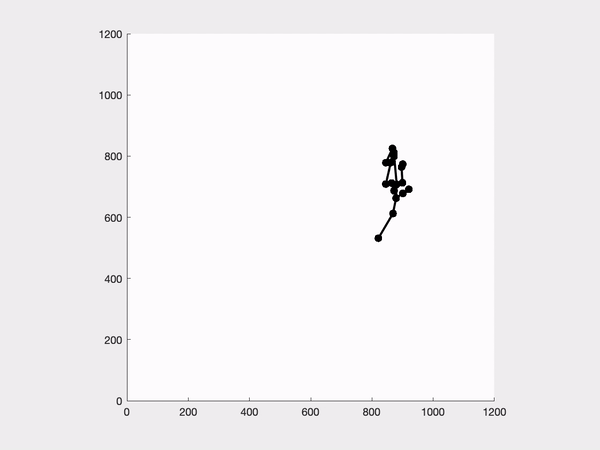
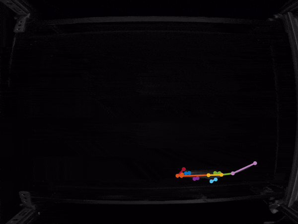
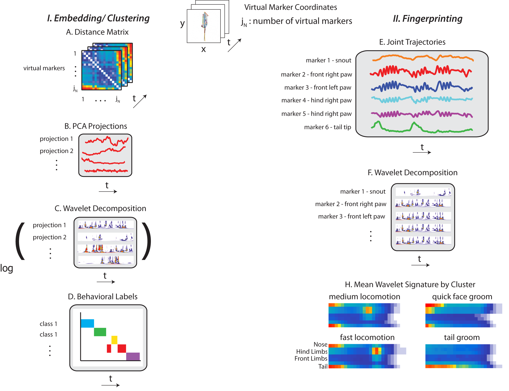

# behavior-map-tutorial
A tutorial and code for running unsupervised behavioral analysis on various animal pose data

Ugne Klibaite + Kanishk Jain for the CAJAL Quantitative Approaches to Behavior Course

22 May - 11 June 2022, Champalimaud Centre for the Unknown, Lisbon, Portugal

This tutorial should walk you through the process of creating, interpreting, and quantifying behavioral maps in order to describe behavior data. 

At this point in the course, you have built a rig for collecting recordings of animal behavior of interest, tracked centroids of lone and multiple animals, used deep networks to label limb and body parts, and have reviewed supervised and unsupervised analysis techniques to apply to this data. 

Let’s get our hands dirty and, starting with some example data, or modify with your own data!

Where is the starting point? Do you have images, tracked joints, or some other representation of the behavior of one or more animals over time? 

Getting the data to an appropriate postural+dynamic representation that is useful for your biological question: compressing the high-dimensional data into a description that captures the variance that you are interested in explaining and characterizing. 

Since we are supplying you with data, don't take our word for what we're handing over. Inspect it yourself!
Movie OFT-0060-00.mp4 corresponds to mouse #5 on day #1 - play a segment of movie with the corresponding labels to confirm that tracking is working.
Build your own skeleton and alter the color map if you'd prefer. 

For a quick and easy display use Animator functions (see the example for more options) 
https://github.com/diegoaldarondo/Animator
Can you recreate something like these movies? 
Here you can see the mouse moving about the open field.

Here I display video frames and overlay the marker positions across a subset of frames.

This figure gives a general idea of how we go from body part coordinates to a behavioral map, and then 
characterize and analyze behavioral clusters

If you have made it this far, you might be interested in comparing groups, analyzing transitions between behaviors,
looking at how behavior changes over time, and any other number of properties of behavior. 

https://github.com/gordonberman/MotionMapper

https://github.com/PrincetonUniversity/MouseMotionMapper

